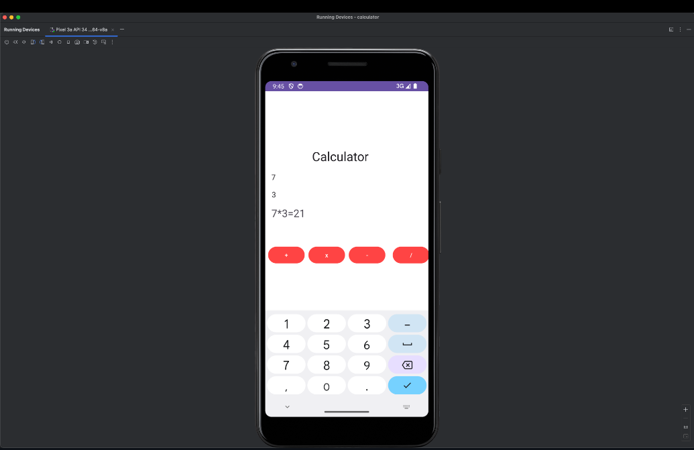

# Ex_5_-Develop a simple calculator using android studio.
## Develop a program to create a simple calculator using Android Studio.

## AIM:
To develop a program to create a simple calculator using Android Studio.

## EQUIPMENTS REQUIRED:
Android Studio(Min. required Artic Fox)

## ALGORITHM:
Step 1: Open Android Studio and then click on File -> New -> New project.

Step 2: Then type the Application name as SMSIntent and click Next.

Step 3: Select the Minimum SDK below and click Next.

Step 4: Then select the Empty Activity and click Next. Finally, click Finish.

Step 5: Design layout in activity_main.xml.

Step 6: Perform the Calculator Operation in MainActivity.java

Step 7: Save and run the application.

## Program:
~~~
Program to create simple calculator using Android Studio.
Developed by: JOTHIKRISHNAA V
RegisterNumber:  212223100017
~~~
MainActivity.java:
~~~
package com.example.calculator;

import androidx.appcompat.app.AppCompatActivity;
//import android.support.v7.app.AppCompatActivity;
import android.os.Bundle;
import android.view.View;
import android.widget.Button;
import android.widget.EditText;
import android.widget.TextView;
import android.widget.Toast;
import android.os.Bundle;
import android.os.Bundle;

import android.os.Bundle;
import android.view.View;
import android.widget.EditText;
import android.widget.TextView;

import androidx.appcompat.app.AppCompatActivity;
public class MainActivity extends AppCompatActivity {
    EditText e1, e2;
    TextView t1;
    int num1, num2;
    @Override
    protected void onCreate(Bundle savedInstanceState) {
        super.onCreate(savedInstanceState);
        setContentView(R.layout.activity_main);
    }

    public boolean getNumbers() {

        e1 = (EditText) findViewById(R.id.num1);

        e2 = (EditText) findViewById(R.id.num2);

        t1 = (TextView) findViewById(R.id.result);

        String s1 = e1.getText().toString();

        String s2 = e2.getText().toString();

        if ((s1.equals(null) && s2.equals(null))
                || (s1.equals("") && s2.equals(""))) {

            String result = "Please enter a value";
            t1.setText(result);

            return false;
        } else {
            num1 = Integer.parseInt(s1);

            num2 = Integer.parseInt(s2);
        }

        return true;
    }

    public void doSum(View v) {

        if (getNumbers()) {
            int sum = num1 + num2;
            t1.setText(num1+"+"+num2+"="+Integer.toString(sum));
        }
    }

    public void doSub(View v) {

        if (getNumbers()) {
            int sub = num1 - num2;
            t1.setText(num1+"-"+num2+"="+Integer.toString(sub));
        }
    }

    public void doMul(View v) {

        if (getNumbers()) {
            int mul = num1 * num2;
            t1.setText(num1+"*"+num2+"="+Integer.toString(mul));
        }
    }

    public void doDiv(View v) {

        if (getNumbers()) {

            double div = num1 / (num2 * 1.0);
            t1.setText(num1 + "/" + num2 + "=" + Double.toString(div));
        }
    }
}
~~~
activity_main.xml:
~~~
<?xml version="1.0" encoding="utf-8"?>
<androidx.constraintlayout.widget.ConstraintLayout
    xmlns:android="http://schemas.android.com/apk/res/android"
    xmlns:app="http://schemas.android.com/apk/res-auto"
    xmlns:tools="http://schemas.android.com/tools"
    android:layout_width="match_parent"
    android:layout_height="match_parent"
    android:background="@color/white"
    tools:context=".MainActivity">

    <TextView
        android:layout_width="194dp"
        android:layout_height="43dp"
        android:layout_marginStart="114dp"
        android:layout_marginLeft="114dp"
        android:layout_marginTop="58dp"
        android:layout_marginEnd="103dp"
        android:layout_marginRight="103dp"
        android:layout_marginBottom="502dp"
        android:scrollbarSize="30dp"
        android:text=" Calculator"
        android:textAppearance="@style/TextAppearance.AppCompat.Body1"
        android:textSize="30dp"
        app:layout_constraintBottom_toBottomOf="parent"
        app:layout_constraintEnd_toEndOf="parent"
        app:layout_constraintStart_toStartOf="parent"
        app:layout_constraintTop_toTopOf="parent" />

    <EditText
        android:id="@+id/num1"
        android:layout_width="364dp"
        android:layout_height="28dp"
        android:layout_marginStart="72dp"
        android:layout_marginTop="70dp"
        android:layout_marginEnd="71dp"
        android:layout_marginBottom="416dp"
        android:background="@android:color/white"
        android:ems="10"
        android:hint="Number 1"
        android:inputType="number"
        app:layout_constraintBottom_toBottomOf="parent"
        app:layout_constraintEnd_toEndOf="parent"
        app:layout_constraintStart_toStartOf="parent"
        app:layout_constraintTop_toTopOf="parent" />

    <EditText
        android:id="@+id/num2"
        android:layout_width="363dp"
        android:layout_height="30dp"
        android:layout_marginStart="72dp"
        android:layout_marginTop="112dp"
        android:layout_marginEnd="71dp"
        android:layout_marginBottom="374dp"
        android:background="@android:color/white"
        android:ems="10"
        android:hint="Number 2"
        android:inputType="number"
        app:layout_constraintBottom_toBottomOf="parent"
        app:layout_constraintEnd_toEndOf="parent"
        app:layout_constraintStart_toStartOf="parent"
        app:layout_constraintTop_toTopOf="parent" />

    <TextView
        android:id="@+id/result"
        android:layout_width="356dp"
        android:layout_height="71dp"
        android:layout_marginStart="41dp"
        android:layout_marginTop="151dp"
        android:layout_marginEnd="48dp"
        android:layout_marginBottom="287dp"
        android:background="@android:color/white"
        android:text="Result"
        android:textColorLink="#673AB7"
        android:textSize="25sp"
        app:layout_constraintBottom_toBottomOf="parent"
        app:layout_constraintEnd_toEndOf="parent"
        app:layout_constraintStart_toStartOf="parent"
        app:layout_constraintTop_toTopOf="parent" />

    <Button
        android:id="@+id/sum"
        android:layout_width="wrap_content"
        android:layout_height="wrap_content"
        android:layout_marginStart="16dp"
        android:layout_marginTop="292dp"
        android:layout_marginEnd="307dp"
        android:layout_marginBottom="263dp"
        android:backgroundTint="@android:color/holo_red_light"
        android:onClick="doSum"
        android:text="+"
        app:layout_constraintBottom_toBottomOf="parent"
        app:layout_constraintEnd_toEndOf="parent"
        app:layout_constraintStart_toStartOf="parent"
        app:layout_constraintTop_toTopOf="parent" />

    <Button
        android:id="@+id/sub"
        android:layout_width="wrap_content"
        android:layout_height="wrap_content"
        android:layout_marginStart="210dp"
        android:layout_marginTop="292dp"
        android:layout_marginEnd="113dp"
        android:layout_marginBottom="263dp"
        android:backgroundTint="@android:color/holo_red_light"
        android:onClick="doSub"
        android:text="-"
        app:layout_constraintBottom_toBottomOf="parent"
        app:layout_constraintEnd_toEndOf="parent"
        app:layout_constraintStart_toStartOf="parent"
        app:layout_constraintTop_toTopOf="parent" />

    <Button
        android:id="@+id/div"
        android:layout_width="wrap_content"
        android:layout_height="wrap_content"
        android:layout_marginStart="307dp"
        android:layout_marginTop="292dp"
        android:layout_marginEnd="16dp"
        android:layout_marginBottom="263dp"
        android:backgroundTint="@android:color/holo_red_light"
        android:onClick="doDiv"
        android:text="/"
        app:layout_constraintBottom_toBottomOf="parent"
        app:layout_constraintEnd_toEndOf="parent"
        app:layout_constraintHorizontal_bias="0.0"
        app:layout_constraintStart_toStartOf="parent"
        app:layout_constraintTop_toTopOf="parent" />

    <Button
        android:id="@+id/mul"
        android:layout_width="wrap_content"
        android:layout_height="wrap_content"
        android:layout_marginStart="113dp"
        android:layout_marginTop="292dp"
        android:layout_marginEnd="210dp"
        android:layout_marginBottom="263dp"
        android:backgroundTint="@android:color/holo_red_light"
        android:onClick="doMul"
        android:text="x"
        app:layout_constraintBottom_toBottomOf="parent"
        app:layout_constraintEnd_toEndOf="parent"
        app:layout_constraintStart_toStartOf="parent"
        app:layout_constraintTop_toTopOf="parent" />

</androidx.constraintlayout.widget.ConstraintLayout>
~~~
AndroidMainfest.xml
~~~
<?xml version="1.0" encoding="utf-8"?>
<manifest xmlns:android="http://schemas.android.com/apk/res/android"
    xmlns:tools="http://schemas.android.com/tools">

    <application
        android:allowBackup="true"
        android:dataExtractionRules="@xml/data_extraction_rules"
        android:fullBackupContent="@xml/backup_rules"
        android:icon="@mipmap/ic_launcher"
        android:label="@string/app_name"
        android:roundIcon="@mipmap/ic_launcher_round"
        android:supportsRtl="true"
        android:theme="@style/Theme.Calculator"
        tools:targetApi="31">
        <activity
            android:name=".MainActivity"
            android:exported="true">
            <intent-filter>
                <action android:name="android.intent.action.MAIN" />

                <category android:name="android.intent.category.LAUNCHER" />
            </intent-filter>
        </activity>
    </application>

</manifest>
~~~
## Output:

## Result:
Thus a Simple Android Application to create a calculator using Android Studio was developed and executed successfully.